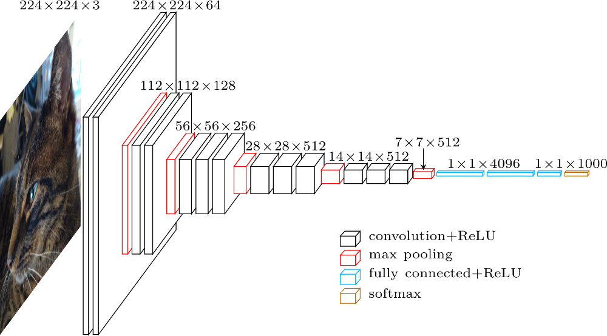
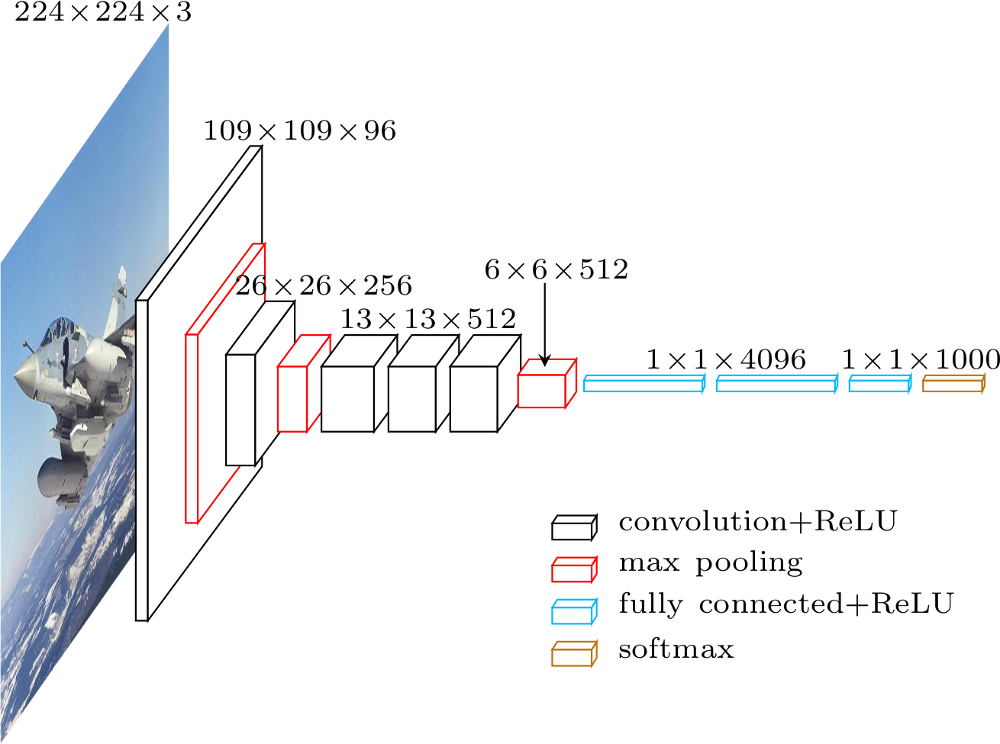

# deep_archi_latex

### VGG16


```
@inproceedings { Simonyan2015,
	year = {2015},
	booktitle = {International Conference on Learning Representations (ICLR)},
	title = {Very Deep Convolutional Networks for Large-Scale Image Recognition},
	author = {Karen Simonyan and Andrew Zisserman}
}
```

### VGG-M



```
@inproceedings { Chatfield2014,
	year = {2014},
	booktitle = {British Machine Vision Conference (BMVC)},
	title = {Return of the Devil in the Details: Delving Deep into Convolutional Nets},
	author = {Ken Chatfield and Karen Simonyan and Andrea Vedaldi and Andrew Zisserman}
}
```
